# Memory Management MCP — Mejoras Priorizadas

> Documento de referencia para evolucionar el sistema de memoria semántica basado en commits.
> Cada mejora se contrasta con el estado actual de la implementación.

---

## Estado Actual vs. Visión

| Aspecto | Implementado Hoy | Visión Objetivo |
|---------|-------------------|-----------------|
| Búsqueda | Vectorial pura (COSINE) | Híbrida (vector + filtros relacionales) |
| Ingesta | 1 registro por archivo por commit, embedding de `intent+what+why+filePath` | Chunking inteligente por tipo de archivo |
| Pruning | Ninguno — crece infinitamente | Consolidación temporal (corto/largo plazo) |
| Contexto Git | Solo `branch` y `author` almacenados | Lineage de commits, divergencia de ramas |
| Filtros | Solo por `kind` (code/doc/config) | Fecha, autor, rama, extensión, tags |
| Metadatos IaC | No diferenciado | Impacto arquitectónico automático |

---

## Tabla de Mejoras Priorizadas

| # | Mejora | Impacto | Esfuerzo | Categoría | Estado |
|---|--------|---------|----------|-----------|--------|
| 0 | **Enriquecimiento de Commits Legacy** — Cola persistente + LLM para inferir intent/what/why en commits pre-estándar | 🔴 Bloqueante | Medio | Ingesta | 🚧 En progreso |
| 1 | **Búsqueda Híbrida** — Combinar VECTOR_DISTANCE con filtros WHERE (fecha, autor, rama, extensión) | 🔴 Crítico | Medio | Búsqueda | ❌ No existe |
| 2 | **Memory Pruning & Consolidación** — Regla de squash + memoria corto/largo plazo | 🔴 Crítico | Alto | Mantenimiento | ❌ No existe |
| 3 | **Commit Lineage** — Dado un commit, recuperar N anteriores/posteriores para contexto de flujo | 🟠 Alto | Bajo | Búsqueda | ❌ No existe |
| 4 | **Chunking Inteligente por Tipo** — IaC por bloques lógicos, deps con flag especial | 🟠 Alto | Alto | Ingesta | ❌ No existe |
| 5 | **Metadata Trimming** — Sanitizar diffs antes de Oracle (ignorar binarios, `go.sum`, archivos generados) | 🟠 Alto | Bajo | Ingesta | ⚠️ Parcial (MAX_HUNK_CONTENT=12K) |
| 6 | **Active Branch Context** — Tool que informa rama actual, upstream, commits divergentes | 🟡 Medio | Bajo | Tools | ❌ No existe |
| 7 | **Impacto Arquitectónico** — Detectar cambios en IaC/deps y generar metadatos enriquecidos | 🟡 Medio | Medio | Ingesta | ❌ No existe |
| 8 | **Grafos de Dependencia** — Vincular commits que tocan archivos relacionados (repo ↔ infra) | 🟡 Medio | Alto | Búsqueda | ❌ No existe |
| 9 | **Alineación de Embeddings** — Validar que el modelo de ingesta y búsqueda sean idénticos | 🟢 Bajo | Bajo | Infra | ✅ Mismo modelo (multilingual-e5-small) |

---

## Detalle de Mejoras

### 0. Enriquecimiento de Commits Legacy (Prioridad Bloqueante)

**Problema:** Commits anteriores al skill de formato no tienen `what:`, `why:` ni `intent` estructurado. El fallback actual (`what = subject del commit`) produce embeddings genéricos que contaminan la búsqueda semántica. Sin esto, indexar historial antiguo es inútil.

**Detección de campos pobres:**
```python
# Un registro necesita enriquecimiento si:
needs_enrichment = (
    intent is None or intent == "" or          # sin tipo convencional
    why is None or why == "" or                 # sin motivación
    what == commit_subject                      # what es solo el subject crudo
)
```

**Arquitectura: Cola persistente + LLM (OpenAI API)**

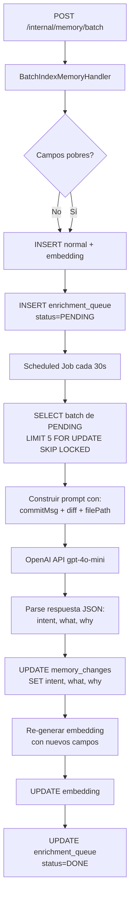

**Prompt del LLM:**
```
Eres un analizador de commits de git. Dado el mensaje del commit, el diff y el archivo,
infiere los campos semánticos estructurados.

Commit message: {commitMsg}
File: {filePath}
Diff (truncado a 2000 chars): {diff}

Responde SOLO con JSON válido:
{
  "intent": "feat|fix|refactor|perf|docs|test|chore|ci|style|sec",
  "what": "<una oración: qué hace el código ahora que no hacía antes>",
  "why": "<una oración: por qué fue necesario este cambio>"
}
```

**Schema de la cola:**
```sql
CREATE TABLE MCP_USER.enrichment_queue (
    id                RAW(16) DEFAULT SYS_GUID() NOT NULL,
    memory_change_id  RAW(16) NOT NULL,
    status            VARCHAR2(20) DEFAULT 'PENDING' NOT NULL,
    attempts          NUMBER(3) DEFAULT 0 NOT NULL,
    last_error        VARCHAR2(1000),
    created_at        TIMESTAMP WITH TIME ZONE DEFAULT SYSTIMESTAMP NOT NULL,
    processed_at      TIMESTAMP WITH TIME ZONE,
    CONSTRAINT pk_enrichment_queue PRIMARY KEY (id),
    CONSTRAINT fk_enrichment_queue_mc
        FOREIGN KEY (memory_change_id) REFERENCES MCP_USER.memory_changes(id),
    CONSTRAINT ck_enrichment_status
        CHECK (status IN ('PENDING', 'PROCESSING', 'DONE', 'FAILED'))
);
```

**Diagrama de secuencia:**

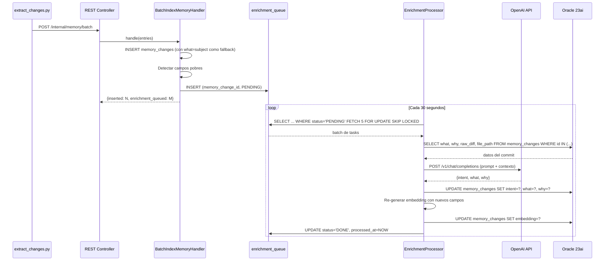

**Intercambiabilidad del LLM:**
- Interface `EnrichmentLlmClient` con método `enrich(commitMsg, diff, filePath) → EnrichmentResult`
- Implementación inicial: `OpenAiEnrichmentClient` (gpt-4o-mini)
- Futuro: `OllamaEnrichmentClient`, `ClaudeEnrichmentClient`

---

### 1. Búsqueda Híbrida (Prioridad Crítica)

**Problema:** Hoy `queryMemory` solo filtra por `kind`. No se puede buscar "cambios de auth hechos por Juan en la última semana".

**Solución:** Nuevo tool `hybridSearchCommits` que combine:
- Similitud vectorial (VECTOR_DISTANCE COSINE)
- Filtros relacionales: `branch`, `author`, rango de `created_at`, `file_path LIKE`, `tags`

**SQL propuesto:**
```sql
SELECT id, commit_hash, file_path, what, why,
       VECTOR_DISTANCE(embedding, ?, COSINE) AS score
FROM memory_changes
WHERE project_id = ?
  AND (:branch IS NULL OR branch = :branch)
  AND (:author IS NULL OR author = :author)
  AND (:since IS NULL OR created_at >= :since)
  AND (:fileLike IS NULL OR file_path LIKE :fileLike)
ORDER BY score ASC
FETCH FIRST ? ROWS ONLY
```

**Impacto en código:**
- `MemoryChangeRepository`: nuevo método `findSimilarHybrid(...)`
- `QueryMemoryHandler`: nuevo `HybridQuery` record
- `MemoryMcpTools`: nuevo tool `hybridSearchCommits`

---

### 2. Memory Pruning & Consolidación (Prioridad Crítica)

**Problema:** La tabla `memory_changes` crece sin límite. Refactorizaciones obsoletas contaminan resultados.

**Estrategia de dos niveles:**

| Nivel | Retención | Datos | Embedding |
|-------|-----------|-------|-----------|
| Memoria de Trabajo | Últimos 30 días | Diff completo + hunks | Vector de `intent+what+why+filePath` |
| Memoria a Largo Plazo | > 30 días | Solo mensaje + lista de archivos | Vector de `commitMsg + fileList` |

**Reglas adicionales:**
- Commits de ramas `feature/*` ya mergeadas → purgar tras 14 días, conservar solo el squash en `main`
- Scheduled job (Spring `@Scheduled`) que ejecute la consolidación diariamente

---

### 3. Commit Lineage (Prioridad Alta)

**Problema:** Un resultado de búsqueda aislado no muestra el "flujo mental" de una refactorización.

**Solución:** Nuevo tool `getCommitLineage(commitHash, projectId, window)` que retorne N commits antes y después del hash dado, ordenados por `created_at`.

**SQL:**
```sql
-- Commits del mismo proyecto ordenados por fecha
WITH target AS (
  SELECT created_at FROM memory_changes
  WHERE project_id = ? AND commit_hash = ?
  FETCH FIRST 1 ROW ONLY
)
SELECT DISTINCT commit_hash, what, why, created_at
FROM memory_changes, target
WHERE project_id = ?
  AND ABS(EXTRACT(EPOCH FROM (created_at - target.created_at))) < 86400 * 3
ORDER BY created_at
```

---

### 4. Chunking Inteligente por Tipo (Prioridad Alta)

**Problema:** Hoy se indexa 1 registro por archivo sin importar su naturaleza. Un `main.tf` de 500 líneas con 10 resources se indexa como un solo bloque.

**Reglas de chunking propuestas:**

| Tipo de Archivo | Estrategia de Chunking |
|-----------------|----------------------|
| IaC (`.tf`, `.cdk.ts`) | 1 chunk por `resource`/`module`/`Construct` |
| Dependencias (`pom.xml`, `go.mod`, `package.json`) | 1 chunk por cambio de versión, flag "ARCH_CHANGE" |
| Código fuente | 1 chunk por función/método modificado (usar hunks + symbol) |
| Documentación | 1 chunk por sección (heading level 2) |
| Config (`.yaml`, `.env`) | 1 chunk por bloque lógico (top-level key) |

**Impacto:** Modificar `extract_changes.py` para aplicar splitting antes de enviar al batch API.

---

### 5. Metadata Trimming (Prioridad Alta)

**Problema:** Archivos generados (`go.sum`, `package-lock.json`, binarios) generan embeddings inútiles.

**Solución:** Lista de exclusión tipo `.gitignore` interno en `extract_changes.py`:

```python
IGNORE_PATTERNS = {
    "go.sum", "package-lock.json", "yarn.lock", "pnpm-lock.yaml",
    "Cargo.lock", "*.min.js", "*.min.css", "*.map",
    "*.pb.go", "*.generated.*", "dist/", "build/", "node_modules/",
}
```

**Estado actual:** Solo hay `MAX_HUNK_CONTENT = 12_000` que trunca diffs largos, pero no excluye archivos.

---

### 6. Active Branch Context (Prioridad Media)

**Nuevo tool MCP:**
```
getActiveBranchContext(projectId) → {
  currentBranch, upstream, aheadCount, behindCount,
  divergentCommits: [{hash, what, author}]
}
```

Ejecutable via git commands en el servidor o delegado al script del agente.

---

### 7. Impacto Arquitectónico (Prioridad Media)

**Enriquecer metadatos** cuando el commit modifica:
- Archivos IaC → tag `INFRA_CHANGE` + descripción ("Modifica políticas IAM")
- Archivos de dependencias → tag `ARCH_CHANGE` + delta de versiones
- Archivos de seguridad → tag `SEC_CHANGE`

**Implementación:** Nuevo paso en `BatchIndexMemoryHandler` que analice `filePath` y `rawDiff` para generar tags automáticos.

---

### 8. Grafos de Dependencia entre Commits (Prioridad Media)

**Concepto:** Si Commit A modifica `/internal/repository/user.go` y Commit B modifica `/infra/dynamo.tf`, vincularlos semánticamente.

**Implementación posible:**
- Nueva tabla `memory_change_links(source_id, target_id, link_type, confidence)`
- Job batch que detecte co-ocurrencia de paths relacionados (mismo directorio padre, mismo bounded context)
- Enriquecer resultados de búsqueda con "commits relacionados"

---

## Diagramas de Flujo

### Flujo de Ingesta Actual

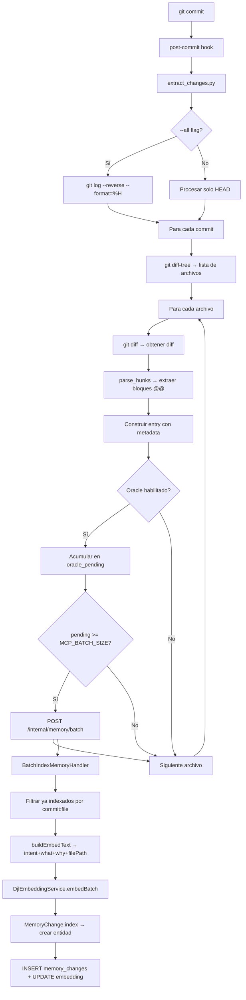

### Flujo de Búsqueda Actual

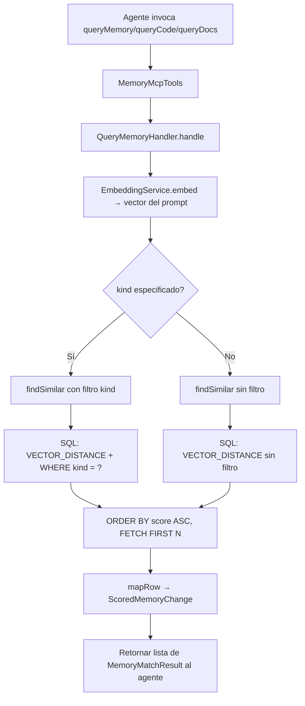

### Flujo de Pruning Propuesto

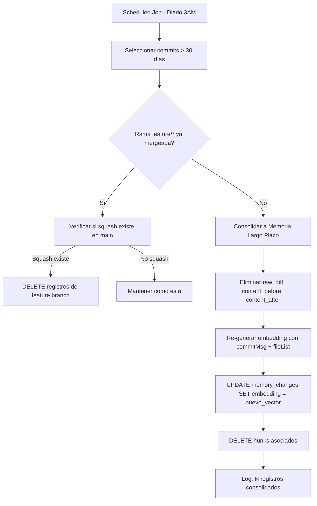

### Flujo de Búsqueda Híbrida Propuesto

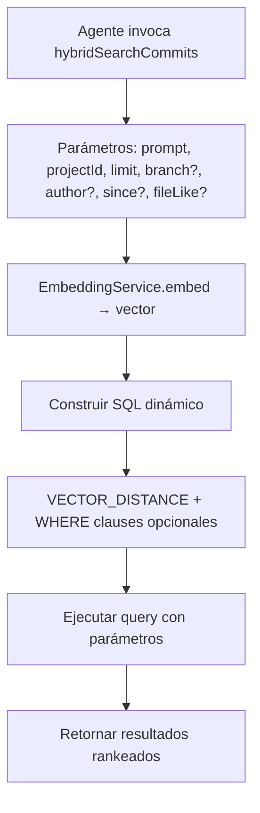

---

## Diagramas de Secuencia

### Secuencia: Ingesta Post-Commit Completa

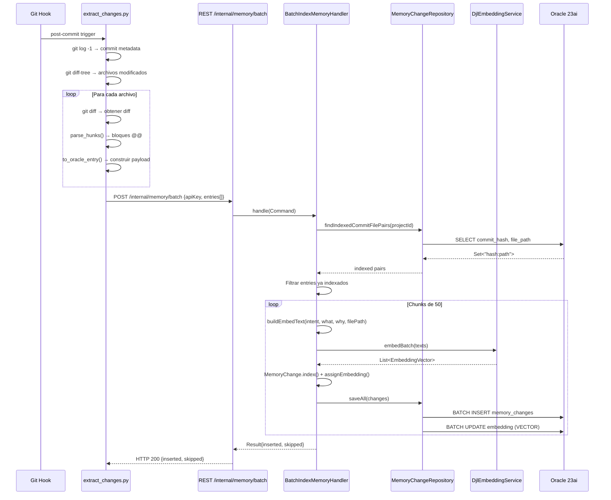

### Secuencia: Búsqueda Semántica (queryMemory)

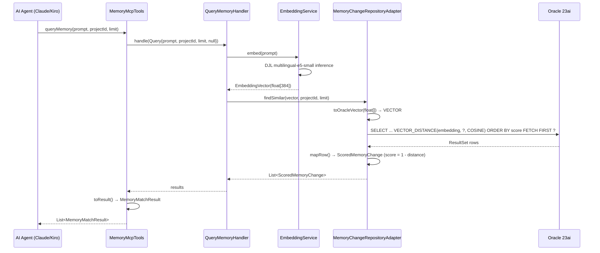

### Secuencia: Session Start con Memory Bootstrap

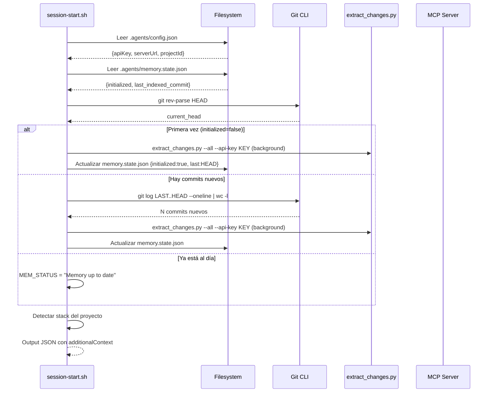

### Secuencia: Búsqueda Híbrida Propuesta

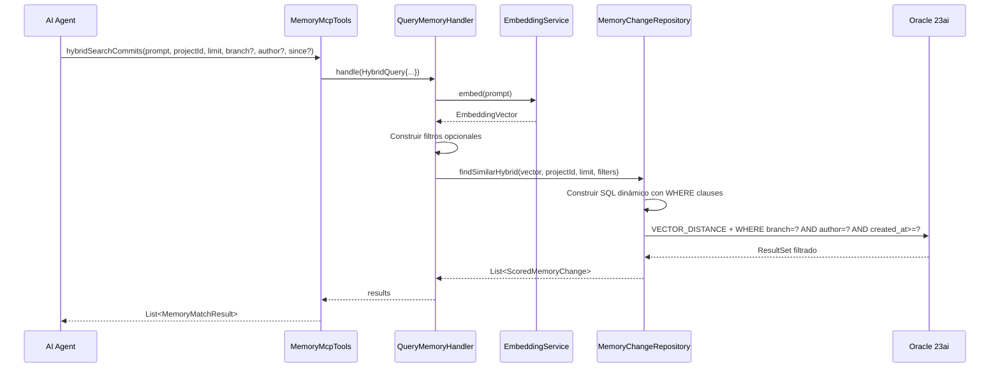

### Secuencia: Commit Lineage Propuesto

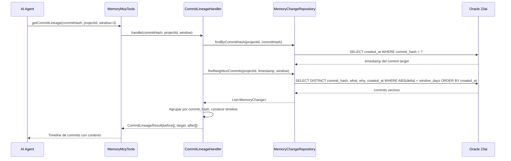

---

## Arquitectura de Componentes

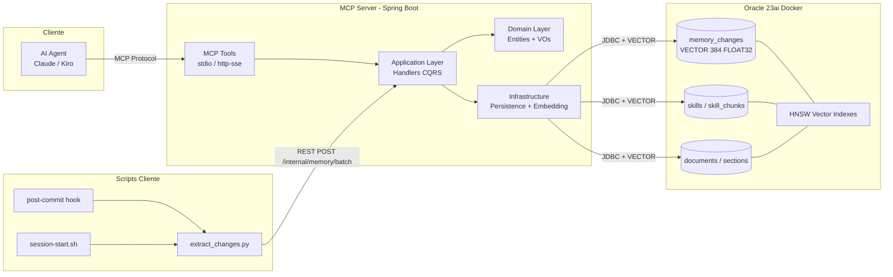

---

## Roadmap de Implementación

| Fase | Mejoras | Semanas Est. |
|------|---------|--------------|
| **Fase 1 — Quick Wins** | Metadata Trimming (#5), Active Branch Context (#6), Commit Lineage (#3) | 1-2 |
| **Fase 2 — Búsqueda** | Búsqueda Híbrida (#1), Impacto Arquitectónico (#7) | 2-3 |
| **Fase 3 — Ingesta** | Chunking Inteligente (#4), Grafos de Dependencia (#8) | 3-4 |
| **Fase 4 — Mantenimiento** | Memory Pruning (#2) — requiere datos históricos para validar | 2-3 |

---

## Notas Técnicas

- **Modelo de embeddings:** `multilingual-e5-small` (384 dims) — ya alineado entre ingesta y búsqueda ✅
- **Índices HNSW:** Target accuracy 95% — suficiente para el volumen actual
- **Batch size:** 50 en Java handler, 10 en Python script — considerar unificar
- **Dual-write Chroma + Oracle:** El script soporta ambos, pero Oracle es el store autoritativo
- **Limitación actual:** No hay re-indexación si el modelo de embeddings cambia — necesitaría migration tool
