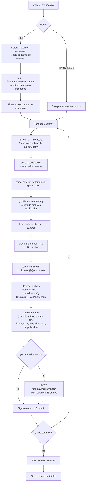
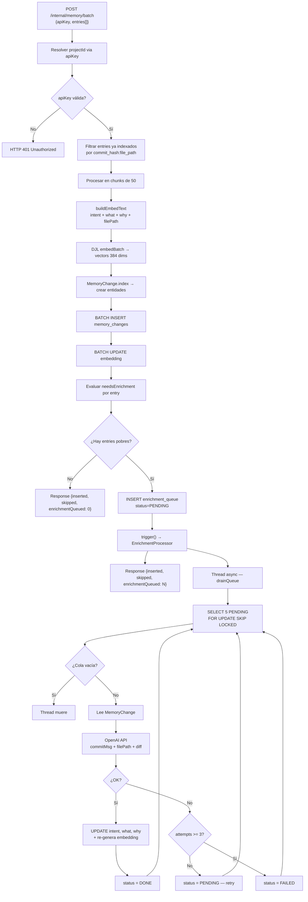

# POST /internal/memory/batch

## Resumen

Único punto de entrada para indexar commits en la memoria semántica del proyecto. Recibe un batch de cambios por archivo (1 entry = 1 archivo en 1 commit), genera embeddings locales con DJL, y los persiste en Oracle 23ai. Si detecta commits con campos semánticos pobres (legacy, sin `intent`/`why`), los encola automáticamente para enriquecimiento asíncrono via LLM.

---

## Diagrama de Flujo — Extracción y Agrupación de Datos (Cliente)

Antes de llegar al endpoint, `extract_changes.py` extrae y agrupa la data desde git:



**Granularidad:** 1 entry = 1 archivo modificado en 1 commit. Un commit que toca 5 archivos genera 5 entries.

**Agrupación por batch:** Se acumulan entries hasta llegar a 25 (`MCP_BATCH_SIZE`), luego se envían al endpoint. Al terminar todos los commits, se hace un flush final con los restantes.

**Campos clave por entry:**

| Campo | Origen | Ejemplo |
|-------|--------|---------|
| `commitHash` | `git log -1 --format=%h` | `a1b2c3d` |
| `branch` | `git branch --contains` | `main` |
| `author` | `git log -1 --format=%an` | `dev@example.com` |
| `filePath` | `git diff-tree --name-only` | `src/auth/middleware.go` |
| `intent` | `parse_commit_parts(subject)` → type | `fix` (null si legacy) |
| `what` | `parse_body(body)` → línea `what:` | Fallback: subject completo |
| `why` | `parse_body(body)` → línea `why:` | null si legacy |
| `kind` | `memory_kind(filePath)` | `code` / `doc` / `config` |
| `language` | extensión del archivo | `go` / `java` / `python` |
| `tags` | `[type, changeType, fileKind, scope]` | `["fix", "modification", "source"]` |
| `hunks` | `parse_hunks(diff)` → bloques @@ | `[{linesStart, linesEnd, symbol, changeType, hunkDiff}]` |

---

## Diagrama de Flujo — Procesamiento en el Endpoint (Server)



---

## Arquitectura — Archivos Involucrados

```
src/main/java/com/cloudcentinel/memory_management_mcp/
├── infrastructure/
│   ├── rest/
│   │   └── (1) MemoryRestController.java              ← Recibe HTTP, resuelve projectId
│   ├── embedding/
│   │   └── (4) DjlEmbeddingService.java               ← Genera embeddings locales
│   ├── persistence/memory/
│   │   ├── (6) MemoryChangeRepositoryAdapter.java      ← INSERT + UPDATE Oracle
│   │   └── (8) EnrichmentTaskRepositoryAdapter.java    ← Cola persistente
│   └── enrichment/
│       ├──     EnrichmentLlmClient.java                ← Interface intercambiable
│       └── (10) OpenAiEnrichmentClient.java            ← Llama OpenAI API
├── application/memory/
│   ├── (2) BatchIndexMemoryHandler.java                ← Orquesta: dedup, embed, persist, detect, enqueue
│   ├── (3) KindClassifier.java                        ← Clasifica archivo → code/doc/config
│   └── (9) EnrichmentProcessor.java                   ← Drain loop async
├── domain/memory/
│   ├── entity/
│   │   ├── (5) MemoryChange.java                      ← Entidad de dominio
│   │   └── (7) EnrichmentTask.java                    ← Entidad de cola
│   └── repository/
│       ├──     MemoryChangeRepository.java            ← Port
│       └──     EnrichmentTaskRepository.java          ← Port
docker/oracle/init/
│   └──     01-schema.sql                              ← Tabla enrichment_queue
src/main/resources/
│   └──     application.yaml                           ← Config enrichment.*
```

---

## Contrato

### Request

```http
POST /internal/memory/batch
Content-Type: application/json
```

```json
{
  "apiKey": "project-api-key",
  "entries": [
    {
      "commitHash": "a1b2c3d",
      "branch": "main",
      "author": "dev@example.com",
      "filePath": "src/auth/middleware.go",
      "intent": "fix",
      "what": "Rejects expired JWT tokens",
      "why": "Expired tokens allowed unauthorized access",
      "kind": "code",
      "language": "go",
      "tags": ["fix", "modification", "source"],
      "rawDiff": "+if token.Expired() { return 401 }",
      "contentBefore": null,
      "contentAfter": null,
      "hunks": [
        {
          "linesStart": 42,
          "linesEnd": 45,
          "symbol": "func AuthMiddleware",
          "changeType": "modification",
          "hunkDiff": "+if token.Expired() {\n+  return 401\n+}"
        }
      ]
    }
  ]
}
```

### Response

```json
{
  "inserted": 47,
  "skipped": 3,
  "enrichmentQueued": 32
}
```

| Campo | Descripción |
|-------|-------------|
| `inserted` | Entries indexados exitosamente |
| `skipped` | Entries que ya existían (dedup por commit_hash:file_path) |
| `enrichmentQueued` | Entries detectados como pobres, encolados para LLM |

### Detección de campos pobres

| Condición | Se encola |
|-----------|-----------|
| `intent` es null o vacío | ✅ |
| `why` es null o vacío | ✅ |
| `what` contiene `:` y > 50 chars (parece subject crudo) | ✅ |

### Configuración del enrichment

```yaml
enrichment:
  enabled: true|false
  llm:
    provider: openai
    openai:
      api-key: ${OPENAI_API_KEY}
      model: gpt-4o-mini
      base-url: https://api.openai.com/v1
```

### Errores

| HTTP | Causa |
|------|-------|
| 401 | apiKey no reconocida |
| 500 | Error de Oracle o embedding |
