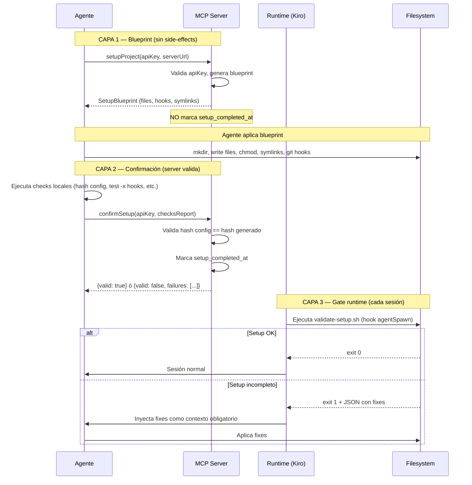
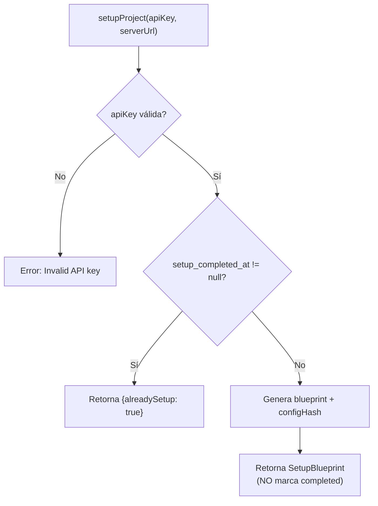
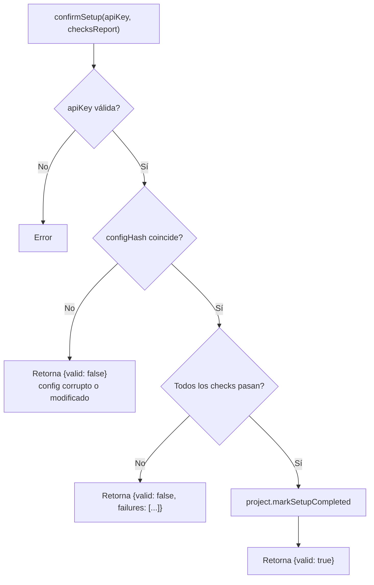
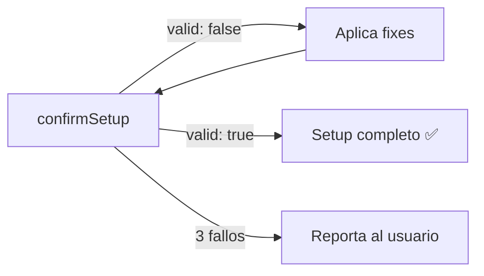

# MCP Tool: setupProject + confirmSetup

## Resumen

Setup del agente en 3 capas con validación cruzada. El server **nunca confía** en que el agente aplicó correctamente — cada capa valida de forma independiente.

| Capa | Quién ejecuta | Qué valida | Si falla |
|------|---------------|------------|----------|
| 1. `setupProject` → blueprint | Server | apiKey válida | Error al agente |
| 2. `confirmSetup` → validación server | Agente → Server | Hash de config + checklist | Rechaza hasta que pase |
| 3. Hook `agentSpawn` → gate runtime | Runtime (Kiro/Claude) | Filesystem local | Inyecta fix instructions al contexto |

**Principio:** El script de validación no depende de que el agente "decida" ejecutarlo — el runtime lo fuerza en cada sesión.

---

## Flujo Completo



---

## Capa 1: `setupProject` — Generación del Blueprint

### Comportamiento

- Valida apiKey
- Genera blueprint completo con todos los archivos
- **NO marca `setup_completed_at`** — eso lo hace `confirmSetup`
- Si ya fue confirmado, retorna `alreadySetup: true`
- Idempotente: puede llamarse N veces sin confirmar

### Parámetros

| Param | Tipo | Requerido | Descripción |
|-------|------|-----------|-------------|
| `apiKey` | String | Sí | API key del proyecto |
| `serverUrl` | String | Sí | URL base del MCP server |

### Retorno: `SetupBlueprint`

```json
{
  "projectName": "my-project",
  "alreadySetup": false,
  "scaffoldVersion": "2026.05.1",
  "configHash": "sha256:abc123...",
  "mkdirs": [".agents", ".agents/scripts", ".agents/skills/commit", ".claude", ".kiro/hooks", ".kiro/steering"],
  "files": [
    {"path": ".agents/config.json", "content": "{...}", "executable": false},
    {"path": ".agents/rules.md", "content": "...", "executable": false},
    {"path": ".agents/scripts/session-start.sh", "content": "...", "executable": true},
    {"path": ".agents/scripts/post-commit", "content": "...", "executable": true},
    {"path": ".agents/scripts/validate-setup.sh", "content": "...", "executable": true}
  ],
  "symlinks": [
    {"link": "CLAUDE.md", "target": ".agents/rules.md"},
    {"link": "AGENTS.md", "target": ".agents/rules.md"},
    {"link": ".kiro/steering/project-rules.md", "target": "../../.agents/rules.md"}
  ],
  "gitHooks": [
    {"fromScaffold": ".agents/scripts/post-commit", "toHook": ".git/hooks/post-commit"}
  ],
  "gitignoreAppend": ".agents/config.json\n",
  "applySteps": [
    {"action": "mkdirs", "paths": ["..."]},
    {"action": "writeFiles"},
    {"action": "copyHooks"},
    {"action": "createSymlinks"},
    {"action": "appendGitignore"},
    {"action": "confirm", "tool": "confirmSetup"}
  ]
}
```

Campos nuevos vs. diseño anterior:
- `scaffoldVersion` — permite detectar drift en sesiones futuras
- `configHash` — SHA-256 del config generado, usado por `confirmSetup` para validar
- `applySteps` — array tipado en vez de prosa libre en `nextSteps`

### Diagrama Interno (Server)



---

## Capa 2: `confirmSetup` — Validación Server-Side

### Comportamiento

El agente ejecuta checks locales y reporta resultados al server. El server valida:
1. Que el `configHash` reportado coincida con el que generó
2. Que todos los checks críticos pasen

Solo si todo pasa → marca `setup_completed_at`.

### Parámetros

| Param | Tipo | Requerido | Descripción |
|-------|------|-----------|-------------|
| `apiKey` | String | Sí | API key del proyecto |
| `checksReport` | Object | Sí | Resultado de validaciones locales del agente |

### `checksReport` Schema

```json
{
  "configHash": "sha256:abc123...",
  "checks": [
    {"name": "config", "exists": true},
    {"name": "hooks", "exists": true, "executable": true},
    {"name": "scripts", "exists": true, "executable": true},
    {"name": "symlinks", "claude_md": true, "agents_md": true, "steering": true},
    {"name": "skills", "exists": true},
    {"name": "memory_state", "exists": true}
  ]
}
```

### Retorno: `SetupValidation`

**Éxito:**
```json
{
  "valid": true,
  "setupCompletedAt": "2026-05-20T03:00:00Z"
}
```

**Fallo:**
```json
{
  "valid": false,
  "failures": [
    {"name": "hooks", "reason": "not executable", "fix": "chmod +x .git/hooks/post-commit"}
  ]
}
```

### Diagrama Interno (Server)



### Loop de Reparación

Si `confirmSetup` retorna `valid: false`, el agente:
1. Lee `failures[].fix`
2. Ejecuta cada fix
3. Vuelve a llamar `confirmSetup`

Máximo 3 intentos. Si no pasa → reporta al usuario.



---

## Capa 3: Hook `agentSpawn` — Gate Runtime

### Propósito

Validación que **el runtime ejecuta automáticamente** en cada inicio de sesión. El agente no puede saltársela.

### Hook Definition

```yaml
# .kiro/hooks/session-start.yaml (ya existente, se extiende)
name: session-start
description: Validates setup integrity + detects stack + bootstraps memory
trigger:
  type: SessionStart
action:
  type: command
  command: .agents/scripts/session-start.sh
  timeout: 5
```

### `validate-setup.sh` (nuevo script en scaffold)

Ejecutado como primera acción dentro de `session-start.sh`:

```bash
#!/usr/bin/env bash
# Validates setup integrity — called by session-start.sh
# Exit 0 = OK, Exit 1 = incomplete (output = fix instructions)

ROOT=$(git rev-parse --show-toplevel 2>/dev/null || pwd)
FAILURES=""

# Check config
[ ! -f "$ROOT/.agents/config.json" ] && FAILURES="$FAILURES\n- MISSING: .agents/config.json (re-run setupProject)"

# Check hooks
[ ! -x "$ROOT/.git/hooks/post-commit" ] && FAILURES="$FAILURES\n- MISSING: .git/hooks/post-commit → fix: cp .agents/scripts/post-commit .git/hooks/post-commit && chmod +x .git/hooks/post-commit"

# Check scripts executable
[ ! -x "$ROOT/.agents/scripts/session-start.sh" ] && FAILURES="$FAILURES\n- NOT EXECUTABLE: session-start.sh → fix: chmod +x .agents/scripts/*.sh"

# Check symlinks
[ ! -L "$ROOT/CLAUDE.md" ] && FAILURES="$FAILURES\n- MISSING SYMLINK: CLAUDE.md → fix: ln -sf .agents/rules.md CLAUDE.md"
[ ! -L "$ROOT/AGENTS.md" ] && FAILURES="$FAILURES\n- MISSING SYMLINK: AGENTS.md → fix: ln -sf .agents/rules.md AGENTS.md"

# Check skills
[ ! -f "$ROOT/.agents/skills/commit/SKILL.md" ] && FAILURES="$FAILURES\n- MISSING: commit skill (re-run setupProject)"

if [ -n "$FAILURES" ]; then
  echo "⚠️ SETUP INCOMPLETE — apply these fixes before continuing:$FAILURES"
  exit 1
fi

exit 0
```

### Comportamiento del Runtime

| Exit code | Efecto |
|-----------|--------|
| 0 | Sesión continúa normal |
| 1 | STDOUT se inyecta al contexto del agente como instrucción obligatoria |

El agente recibe algo como:
```
⚠️ SETUP INCOMPLETE — apply these fixes before continuing:
- MISSING: .git/hooks/post-commit → fix: cp .agents/scripts/post-commit .git/hooks/post-commit && chmod +x .git/hooks/post-commit
```

Y debe ejecutar los fixes antes de cualquier otra acción.

---

## ¿Por qué 3 capas?

| Escenario de fallo | Capa 1 sola | + Capa 2 | + Capa 3 |
|--------------------|-------------|----------|----------|
| Agente se interrumpe a mitad del blueprint | ❌ Server ya marcó completed | ✅ Server no marcó nada | ✅ |
| Agente reporta éxito pero mintió | ❌ | ❌ Hash no coincide | ✅ Hook detecta en runtime |
| Archivo se borra después del setup | ❌ | ❌ | ✅ Hook detecta cada sesión |
| Agente no ejecuta el script de validación | ❌ | ❌ | ✅ Runtime lo fuerza |

La capa 3 es la que resuelve el problema recursivo: "si el agente falla en validar, ¿quién valida al validador?" — **el runtime**, que está fuera del control del agente.

---

## Precondiciones en Tools MCP

Una vez implementado, todos los tools MCP validan:

```java
if (!project.isSetupCompleted()) {
    return "Setup not confirmed. Call confirmSetup(apiKey, checksReport) first.";
}
```

Esto impide que el agente use `queryMemory`, `querySkills`, etc. sin haber completado el setup validado.

---

## Arquitectura — Archivos Involucrados

```
src/main/java/.../infrastructure/mcp/
├── SetupMcpTools.java              ← setupProject (genera blueprint, NO marca completed)
├── SetupValidationMcpTools.java    ← confirmSetup (valida + marca completed)  [NUEVO]
├── MemoryMcpTools.java             ← precondición: isSetupCompleted()
└── SkillMcpTools.java              ← precondición: isSetupCompleted()

src/main/resources/scaffold/
├── scripts/
│   ├── validate-setup.sh           ← Validación filesystem [NUEVO]
│   ├── session-start.sh            ← Llama validate-setup.sh primero
│   └── post-commit                 ← Git hook
└── .kiro/hooks/
    └── session-start.yaml          ← Trigger: SessionStart → session-start.sh
```

---

## Estructura Desplegada (post-setup)

```
proyecto-cliente/
├── .agents/
│   ├── config.json              ← Credenciales (gitignored)
│   ├── memory.state.json        ← Estado de indexación
│   ├── rules.md                 ← Protocolo MCP del agente
│   ├── scripts/
│   │   ├── validate-setup.sh    ← [NUEVO] Validación de integridad
│   │   ├── extract_changes.py   ← Extractor de commits
│   │   ├── session-start.sh     ← Bootstrap de sesión (llama validate-setup.sh)
│   │   ├── post-commit          ← Source del git hook
│   │   ├── prompt-guard.sh      ← Validador de prompts
│   │   ├── validate-commit.sh   ← Validador de commits
│   │   └── generate-changelog.py
│   └── skills/
│       └── commit/SKILL.md
├── .kiro/
│   ├── hooks/
│   │   ├── session-start.yaml   ← Gate: valida setup + detecta stack + memory
│   │   ├── validate-commit.yaml
│   │   ├── post-commit-clear.yaml
│   │   └── prompt-guard.yaml
│   └── steering/
│       └── project-rules.md → ../../.agents/rules.md
├── .git/hooks/
│   └── post-commit              ← Copia de .agents/scripts/post-commit
├── CLAUDE.md → .agents/rules.md
├── AGENTS.md → .agents/rules.md
└── .gitignore (con .agents/config.json)
```

---

## Contrato de Errores

| Error | Tool | Causa |
|-------|------|-------|
| `Invalid API key` | setupProject / confirmSetup | apiKey no existe |
| `Config hash mismatch` | confirmSetup | config.json fue modificado post-generación |
| `Setup not confirmed` | queryMemory / querySkills | Agente no completó confirmSetup |
| `Check failed: hooks` | confirmSetup | post-commit hook no existe o no es ejecutable |

---

## Migración desde Diseño Anterior

| Antes | Ahora |
|-------|-------|
| `setupProject` marca `setup_completed_at` | Solo `confirmSetup` marca completed |
| `nextSteps` es prosa libre | `applySteps` es array tipado |
| Sin validación post-apply | `confirmSetup` + hook runtime |
| Sin versionado de scaffold | `scaffoldVersion` en config |
| Sin detección de drift | Hook detecta archivos faltantes cada sesión |
